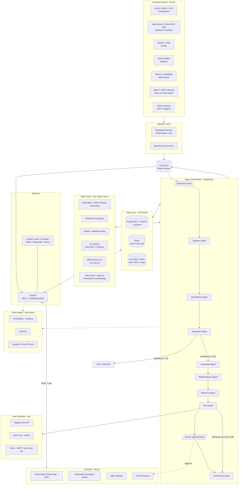
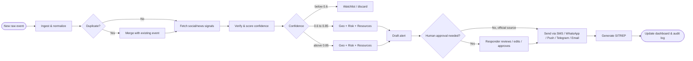
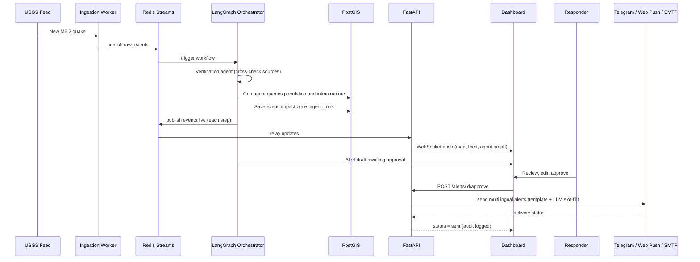
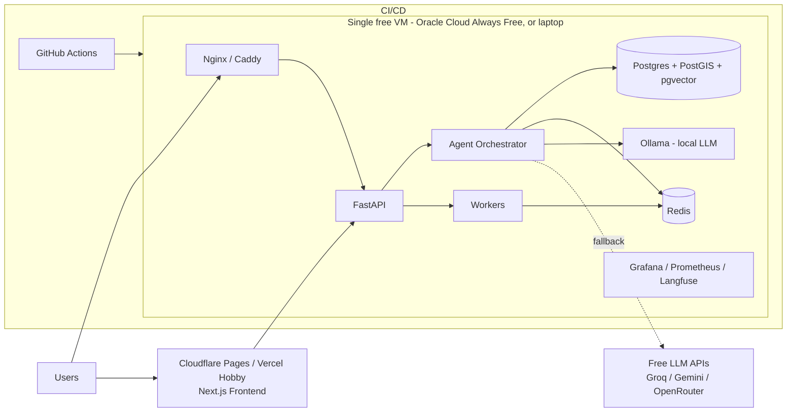

# Multi-Agent Disaster Intelligence Platform
### Project Brief: Problem, Market Gap, Features, and System Design

> **Project constraint:** The entire platform is built with **free and open-source tools and free data sources only**. No paid APIs or subscriptions. See Section 7 for the full free stack and the trade-offs it brings.

---

## 1. Problem Statement

During a disaster (earthquake, flood, cyclone, wildfire, landslide), the information that responders and citizens need is scattered across dozens of disconnected sources: government agencies, satellite feeds, news, and social media. It arrives late, in different formats, in different languages, with no reliable way to tell what is true.

Emergency teams lose critical hours manually collecting, cross-checking, and summarizing data before they can act. Citizens receive generic, delayed, or unverified warnings. Misinformation spreads faster than official guidance.

**Core problem:** There is no single, real-time, verified, location-aware system that turns raw multi-source hazard data into clear, trustworthy, actionable decisions for both responders and the public.

**Goal:** Build a multi-agent AI platform where specialized agents ingest, verify, analyze, predict, and communicate disaster information end to end, with humans approving life-safety decisions.

---

## 2. Pain Points

### 2.1 For emergency responders and authorities
| # | Pain point | Impact |
|---|---|---|
| 1 | Data is fragmented across many portals, PDFs, feeds, and WhatsApp groups | Slow situational awareness |
| 2 | Manual verification of reports | Hours lost; errors under pressure |
| 3 | Duplicate reports of the same event from multiple sources | Noise, confusion, wasted resources |
| 4 | No quick estimate of affected population and infrastructure | Poor resource prioritization |
| 5 | Situation reports (SITREPs) are written by hand | Delays and inconsistent quality |
| 6 | Hard to find nearest shelters, hospitals, and safe routes quickly | Slower rescue and evacuation |
| 7 | Alerts drafted manually, one language at a time | Delayed and incomplete public communication |

### 2.2 For citizens
| # | Pain point | Impact |
|---|---|---|
| 1 | Alerts are generic (district or state level), not "your street" | People ignore or misjudge risk |
| 2 | Alerts arrive late or only in one language | Vulnerable groups are left out |
| 3 | Rumors and fake news spread on social media | Panic, unsafe decisions |
| 4 | No easy way to report what they see | Ground truth is lost |
| 5 | Poor connectivity during disasters | Apps and sites fail when needed most |
| 6 | Unclear what to do next | Alerts say "what happened" but not "what should I do" |

### 2.3 For technical and operational teams
| # | Pain point | Impact |
|---|---|---|
| 1 | Every data source has a different format and reliability | High integration cost |
| 2 | AI tools hallucinate facts | Dangerous in life-safety contexts |
| 3 | No audit trail for automated decisions | Low trust and accountability |
| 4 | Systems are built for one hazard only | Duplicate tooling for each disaster type |

---

## 3. Features

### 3.1 Core features
1. **Multi-source live ingestion**: earthquakes, floods, cyclones, wildfires, and rainfall from official and open feeds.
2. **Social and news signal detection**: extracts location, hazard, and severity from posts and articles in multiple languages.
3. **Automated verification with confidence score**: cross-source agreement, duplicate merging, and fake-report detection (0 to 1 score with visible reasoning).
4. **Impact estimation**: affected area polygon, exposed population, hospitals, roads, and schools in the zone.
5. **Risk forecasting**: flood spread, fire spread, aftershock likelihood, and cyclone track impact over the next hours.
6. **Resource and route recommendation**: nearest shelters, hospitals, NGOs, and safe evacuation routes.
7. **Alert drafting and delivery**: multilingual, location-targeted messages via Telegram, web push (PWA), and email. SMS/WhatsApp are optional add-ons (see Section 7.3).
8. **Automatic SITREP generation**: one-click situation report (Markdown/PDF) with sources cited.

### 3.2 Command center dashboard (responders)
- Live map with layered hazards, impact zones, and resources
- Real-time event feed with severity and confidence badges
- Agent Monitor: live graph of agent status, logs, latency, and a "replay run" button
- Alert composer with AI draft, human edit, audience polygon, and approval workflow
- Event detail page with timeline, sources, forecast, and agent trace
- Analytics on past events, response times, and false-alarm rate

### 3.3 Public app (citizens)
- Simple "Near me" risk card and full-screen map
- One-tap citizen report with photo and location
- Personalized subscriptions by area, hazard, and language
- Offline-friendly safety guides (PWA)
- Plain-language "What should I do now?" guidance

### 3.4 Trust and safety features
- Every fact shows its **source and confidence**
- **Human-in-the-loop approval** for life-safety alerts unless the source is an official authority
- Full **audit log** of every agent step and every alert approved
- Prompt-injection protection: social text is treated as data, never as instructions
- "Data stale" banners and cached fallbacks when feeds fail

---

## 4. Existing Projects With a Similar Idea and Their Limitations

> Note: Descriptions below reflect general public knowledge of these tools and may have changed. Verify current capabilities before using them in a pitch or paper.

| Project | What it does | Limitations / gaps |
|---|---|---|
| **GDACS** (UN/EU Global Disaster Alert and Coordination System) | Global multi-hazard alerts and impact estimates | Mostly large-scale events; coarse local detail; limited social verification; no citizen-level personalized guidance |
| **Google Flood Hub / Crisis Response** | Flood forecasts and public alerts | Flood-focused; closed and proprietary; not a multi-hazard responder command tool |
| **Ushahidi** | Crowdsourced crisis reporting and mapping | Relies on manual moderation; no automated verification, prediction, or alert drafting |
| **PDC DisasterAWARE** | Multi-hazard monitoring and decision support | Often commercial/enterprise-oriented; not open; limited AI reasoning and multilingual public alerts |
| **Copernicus EMS / Sentinel-based mapping** | High-quality satellite damage and flood maps | Activation is on-request and slow for real-time use; expert-driven, not automated end to end |
| **ReliefWeb** | Aggregated humanitarian reports and updates | A publishing platform, not a live analysis engine; no geospatial impact scoring or alerting |
| **Sahana Eden** | Open-source disaster management (resources, shelters, volunteers) | Focused on logistics and coordination; weak on real-time detection, verification, and AI |
| **AIDR / social-media crisis classifiers** (research tools) | Classify disaster tweets | Single-purpose; no cross-checking with official data, no impact estimate or alerting |
| **NDMA SACHET / IMD apps (India)** | Official CAP-based alerts and weather warnings | Authoritative but mostly one-way; limited fusion with ground reports, hyperlocal impact, or automated briefings |
| **Commercial risk-analytics platforms** (e.g., insurance/catastrophe modeling tools) | Risk and loss modeling | Expensive; built for insurers and enterprises, not for public safety or live response |

### 4.1 Common gaps across existing solutions
1. **Siloed by hazard or by function**: detection, verification, mapping, and alerting live in separate tools.
2. **Weak verification**: most tools either trust everything or need manual moderation.
3. **Limited hyperlocal targeting**: alerts are district-level, not street or zone level.
4. **No explainability**: users can't see why a system believes an event is real.
5. **Little automation of reporting**: SITREPs and alerts are still hand-written.
6. **Poor language and low-bandwidth support**: especially for regional Indian languages.
7. **Closed or expensive**: hard for local governments, NGOs, and students to adopt.
8. **Single AI model risk**: where AI is used, it is often one model with no fact-checking tools or audit trail.

---

## 5. Unique Solution and Differentiators

### 5.1 Our approach
A **team of specialized AI agents**, each with one job, strict input/output schemas, and real tools (APIs, geospatial queries), coordinated by a supervisor graph. Agents fetch facts instead of guessing them, and humans approve anything that affects lives.

### 5.2 What makes it different
| Differentiator | How we deliver it | Gap it closes |
|---|---|---|
| **End-to-end pipeline in one system** | Ingest → Verify → Geo-impact → Forecast → Resources → Alert → Report | Siloed tools |
| **Multi-agent cross-verification** | Verification agent scores official feeds vs. social/news vs. citizen reports | Weak verification and misinformation |
| **Explainable confidence** | Every event shows source list, agreement score, and reasoning trace | No explainability |
| **Hyperlocal, actionable alerts** | Alert agent uses impact polygons and nearby resources to say "what to do and where to go" | Generic alerts |
| **Multilingual by design** | English, Tamil, Hindi, and more, with simple-language mode | Language exclusion |
| **Human-in-the-loop safety** | Confidence gates: below 0.6 dropped or watch-listed, 0.6 to 0.85 human review, above 0.85 with official source can auto-alert | Dangerous false alarms |
| **Agent Monitor and full audit trail** | Live agent graph, replayable runs, logged approvals | Black-box automation |
| **Multi-hazard, plug-in architecture** | New hazard = new tools plus prompt, not a new system | Hazard-specific tools |
| **Works in low-connectivity settings** | PWA, cached guides, Telegram and web push fallback | Failure during outages |
| **100% free and open-source stack** | Free data sources, local open-source LLMs, self-hosted services, zero paid dependencies | Expensive commercial tools |
| **Auto-generated SITREPs** | Summarizer agent produces cited reports in seconds | Manual reporting delays |
| **Prompt-injection resilient** | Untrusted text is sanitized and agents have constrained tools | AI safety risk |

### 5.3 Value summary
- **Responders:** minutes instead of hours to reach a verified, mapped, prioritized picture.
- **Citizens:** timely, local, understandable guidance in their language.
- **Authorities:** a transparent decision-support tool with an audit trail, not a black box.

### 5.4 Positioning statement
> *"A verified, explainable, multilingual disaster intelligence layer that sits on top of official data and public signals, turning them into hyperlocal, human-approved action."*

It complements official agencies (IMD, NDMA, USGS) rather than replacing them. Alerts are labeled **advisory** unless relayed from an official source with attribution.

---

## 6. System Design

### 6.1 High-level architecture (free stack)

### 6.2 Agent workflow (decision flow)

### 6.3 Real-time sequence (example: earthquake)

### 6.4 Deployment view (free hosting)

Everything runs from a single `docker-compose.yml`. Managed free tiers (Supabase or Neon for Postgres, Render or Koyeb for the API) are alternatives if you have no VM.

### 6.5 Core data model (summary)

| Table | Purpose |
|---|---|
| `events` | Verified disaster events with type, severity, confidence, point and impact polygon |
| `raw_signals` | Raw feed, news, and social payloads (time-series) |
| `agent_runs` | Every agent input, output, duration, and tokens (audit + Agent Monitor) |
| `forecasts` | Predicted spread or severity per time horizon |
| `resources` | Shelters, hospitals, NGOs, fire stations |
| `alerts` | Drafts and sent alerts, language, audience polygon, approver |
| `citizen_reports` | User-submitted reports with location and media |
| `users`, `subscriptions` | Roles, language, notification preferences, area subscriptions |

---

## 7. Tech Stack (100% Free and Open Source)

Free-tier limits and licenses change often. Verify each one before committing.

### 7.1 Stack summary

| Layer | Technology |
|---|---|
| Frontend | Next.js, TypeScript, Tailwind, shadcn/ui, MapLibre GL, deck.gl, React Flow, Zustand, TanStack Query, next-intl |
| Backend | Python, FastAPI, Pydantic v2, APScheduler/Arq |
| Agents | LangGraph, Ollama (Qwen2.5 7B / Llama 3.1 8B / Gemma 2) via LiteLLM |
| Geospatial | PostGIS, Shapely, GeoPandas, rasterio, OSM, WorldPop |
| ML | scikit-learn, XGBoost, PyTorch |
| Data | PostgreSQL + PostGIS + pgvector, Redis (or Valkey), local disk or MinIO |
| Messaging | Redis Streams |
| Auth | FastAPI-Users (simple) or Keycloak / Supabase Auth self-hosted |
| Alerts | Telegram Bot API, Web Push (VAPID), SMTP/Brevo free tier |
| Infra | Docker Compose, GitHub Actions, optional k3s |
| Observability | Prometheus, Grafana, GlitchTip, self-hosted Langfuse or Arize Phoenix |

### 7.2 Paid to free replacements

| Category | Paid option (avoided) | Free alternative | Notes |
|---|---|---|---|
| **LLM** | Claude / GPT APIs | **Ollama** local models; free tiers of **Groq**, **Google Gemini**, **OpenRouter**, **Hugging Face** | Local needs about 16 GB RAM; free APIs are rate-limited. Use **LiteLLM** to swap models without code changes |
| **Embeddings** | Paid embedding APIs | **sentence-transformers** (`bge-m3`, `multilingual-e5`) | Runs locally; supports Tamil and Hindi |
| **Translation** | Paid translate APIs | **IndicTrans2**, **NLLB-200**, **Argos Translate** | IndicTrans2 is best for Indian languages; NLLB-200 license is non-commercial |
| **Vector DB** | Qdrant Cloud, Pinecone | **pgvector** in Postgres, or self-hosted Qdrant | pgvector means one less service |
| **Maps / tiles** | Mapbox | **MapLibre GL JS** with **OpenFreeMap** or self-hosted **Protomaps (PMTiles)** | Do not hammer public OSM tile servers |
| **Geocoding** | Google Geocoding | **Nominatim** (1 req/sec on public server) or self-hosted **Photon** | Cache results aggressively |
| **Routing** | Google Directions | **OSRM**, **Valhalla**, **OpenRouteService** free API | Self-host with an OSM extract of your state |
| **Satellite** | Sentinel Hub | **Copernicus Data Space**, **NASA Earthdata**, **AWS Earth Search STAC** | Free with registration |
| **Weather** | Paid weather APIs | **Open-Meteo**, **NOAA GFS**, **NASA POWER** | Open-Meteo is free for non-commercial use |
| **News / social** | NewsAPI paid tiers | **GDELT**, RSS feeds, Google News RSS, **Bluesky Jetstream**, **ReliefWeb API** | Use Reddit API sparingly |
| **Auth** | Clerk, Auth0 | **FastAPI-Users**, **Keycloak**, **Auth.js**, **Supabase Auth** | FastAPI-Users is simplest |
| **Object storage** | AWS S3 | Local disk, **MinIO**, **Garage** | Local disk is fine for an MVP |
| **Message bus** | Kafka | **Redis Streams** | Kafka is overkill at this scale |
| **Time series** | Timescale Cloud | Plain Postgres with partitioning, or TimescaleDB Community | |
| **Error tracking** | Sentry cloud | **GlitchTip** | Sentry-compatible |
| **LLM tracing** | LangSmith | **Langfuse** self-hosted or **Arize Phoenix** | |
| **Metrics** | Datadog | **Prometheus + Grafana** | |
| **CI/CD** | Paid CI | **GitHub Actions** | Free for public repos; limited minutes for private |
| **Orchestration** | Managed Kubernetes | **Docker Compose**; **k3s** if needed | Skip Kubernetes initially |

### 7.3 Alert channels without Twilio

| Channel | Free option | Caveat |
|---|---|---|
| **Telegram** | Telegram Bot API | Free and reliable. Primary channel |
| **Web push (PWA)** | Web Push with VAPID keys (no Firebase needed) | Works on Android and desktop, and on iOS for installed PWAs |
| **Email** | Brevo or Resend free tiers; Gmail SMTP for demos | Daily send limits |
| **WhatsApp** | Meta Cloud API free tier for some conversation types | Needs business account and verification; slow to set up |
| **SMS** | Android phone as gateway (open-source SMS gateway apps) or USB GSM modem with Gammu | Uses your own SIM plan; demo only, not mass alerts |
| **Sirens / cell broadcast** | Not feasible | Only authorities such as NDMA can do this |

**Recommendation:** demo Telegram, web push, and email. Present SMS and cell broadcast as future integration with official agencies.

### 7.4 Free hosting options

| Need | Option |
|---|---|
| Local development | Docker Compose on your laptop |
| Frontend | Vercel Hobby (non-commercial), Cloudflare Pages, or Netlify free tier |
| Backend and DB | Oracle Cloud Always Free ARM VM (runs Postgres, Redis, FastAPI); Render or Koyeb free tiers (may sleep when idle) |
| Managed Postgres | Supabase or Neon free tiers (check current limits) |
| ML/LLM demo | Hugging Face Spaces (free CPU) |
| Student credits | GitHub Student Developer Pack |
| Domain | Free subdomain from Vercel or Cloudflare |

### 7.5 Data sources (all free)

USGS, EMSC, GDACS, NASA FIRMS (free MAP_KEY), Open-Meteo, GloFAS/Copernicus, IMD public feeds, ReliefWeb, GDELT, OpenStreetMap, WorldPop, Bhuvan.

### 7.6 Design adjustments for small free models

Local models are weaker than frontier APIs at tool use and reasoning, so the design changes:

1. **Use LLMs only for language tasks**: extracting location and hazard from text, translating, drafting, summarizing.
2. **Use plain code for everything else**: deduplication by distance and time, severity thresholds, PostGIS impact queries, routing. Faster, free, and more reliable.
3. **Force structured output** with Ollama JSON schema mode or the Outlines library.
4. **Keep prompts short**, one job per agent.
5. **Fallback chain via LiteLLM**: local model first, then a free API tier if the local model fails or is too slow.
6. **Cache** LLM and geocoding results to stay within free rate limits.
7. **Template-based alerts**: the LLM fills slots (place, hazard, action) instead of writing freely. This is safer for life-safety text.

### 7.7 Minimum viable free stack

Next.js + MapLibre + OpenFreeMap, FastAPI, PostgreSQL/PostGIS/pgvector, Redis, LangGraph + Ollama (via LiteLLM), Telegram + web push + email, FastAPI-Users, Grafana + Langfuse (self-hosted), deployed with Docker Compose on Oracle Cloud Free or Render.

---

## 8. Risks and Mitigations

| Risk | Mitigation |
|---|---|
| False alarms cause panic | Confidence gates, human approval, official-source priority |
| LLM hallucination | Tool-grounded facts, strict schemas, evals on past disasters |
| Prompt injection via social posts | Treat text as untrusted data, sanitize, restrict tool permissions |
| Source outage during a disaster | Caching, fallbacks, "data stale" banners, redundant sources |
| Legal issues issuing warnings | Label as advisory; relay official alerts with attribution |
| Privacy of citizen reports | Minimize and expire precise location data; follow India's DPDP Act |
| Alert spam on restarts | Idempotent workers with event-hash dedupe |
| Small local LLMs are less accurate | Use LLMs only for language tasks, enforce JSON schemas, use rule-based code for logic, template alerts, add human review |
| Free-tier rate limits and sleeping servers | Cache aggressively, LiteLLM fallback chain, keep-alive pings, prefer a self-hosted VM for the core services |
| Free tiers or licenses change (e.g., non-commercial terms) | Recheck terms before launch; keep components swappable behind interfaces |
| No mass SMS or cell broadcast | Use Telegram, web push, and email; relay official alerts; plan integration with authorities later |

---

## 9. Success Metrics

- **Time-to-verified-event:** minutes from first signal to verified event
- **Time-to-alert:** from detection to approved alert sent
- **Verification precision and recall** against historical disasters
- **False-alarm rate** (target: as low as possible, tracked per source)
- **Alert reach and language coverage**
- **Responder time saved** in SITREP and situational awareness tasks

---

## 10. Suggested Roadmap

| Phase | Duration | Deliverable |
|---|---|---|
| 1. MVP | 2-3 weeks | Data ingestion (USGS, GDACS, Open-Meteo), API, live map |
| 2. Agents | 3-4 weeks | Ingestion, Verification, Summarizer agents; Agent Monitor |
| 3. Intelligence | 3-4 weeks | Geospatial impact, risk forecasting, resource recommendations, RAG |
| 4. Alerts and users | 2-3 weeks | Alert agent, approval flow, Telegram/web push/email delivery, auth, citizen reports |
| 5. Hardening | 2+ weeks | Evals, load tests, monitoring, free-tier deployment, PWA |

---

*Diagrams use Mermaid syntax and render in GitHub, GitLab, VS Code (Markdown Preview Mermaid Support), Obsidian, and Notion.*
