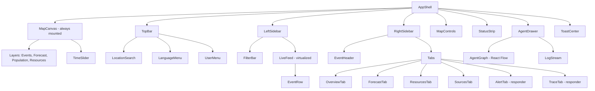
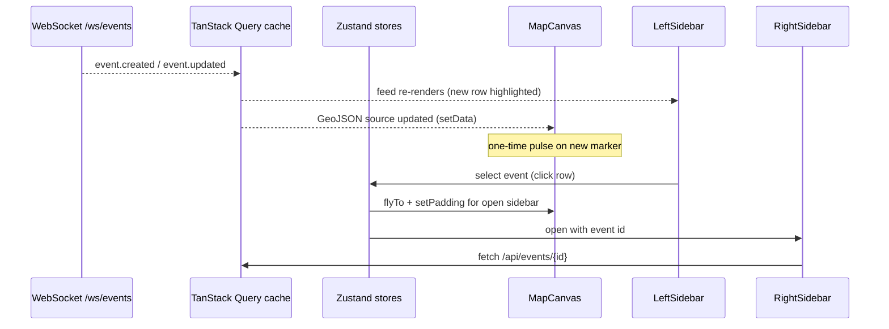

# Frontend Design Document
### Multi-Agent Disaster Intelligence Platform: Map-First, Minimal Interface

---

## 1. Design Vision

**The map is the product.** The interface is a full-screen map with almost nothing on top of it. Everything else (event feed, details, filters, agent activity, alerts) lives in two collapsible sidebars that open when needed and disappear when not.

> *"Open the app, see the world, see what is happening. Ask for more only when you want it."*

### 1.1 Principles

| # | Principle | What it means in practice |
|---|---|---|
| 1 | **Map first** | The map fills 100% of the viewport. UI floats above it. |
| 2 | **Hidden until needed** | Sidebars are closed by default (or slim). Details appear on demand. |
| 3 | **One glance, one meaning** | Severity is shown by color + shape + size. No reading required. |
| 4 | **Calm under stress** | Few colors, no clutter, no decorative animation. Motion only signals change. |
| 5 | **Trust visible** | Every event shows a source count and confidence, one click away. |
| 6 | **Works everywhere** | Same layout scales from phone to control-room monitor; usable on weak networks. |
| 7 | **Accessible by default** | Never color alone; keyboard navigable; screen-reader labels; high contrast. |

### 1.2 What we deliberately leave out
- No permanent dashboards of charts on the main screen
- No top navigation menus with many links
- No cards, banners, or promos on the map
- No auto-opening popups except a critical-event toast

---

## 2. Layout Overview

### 2.1 Default state (both sidebars closed)

```
┌──────────────────────────────────────────────────────────────────────┐
│ [≡]  DisasterIntel        [ 🔍 Search place ]      [⚙] [🌐 EN] [👤] │  ← slim floating bar
│                                                                      │
│                                                                      │
│                                                                      │
│                       F U L L   S C R E E N   M A P                  │
│                                                                      │
│              ●  quake            ░░░░ flood zone                     │
│                       🔥 fire                                        │
│                                                                      │
│                                                                      │
│                                                              [＋]    │
│  [🗂 Layers]    [🎯 Filters]                                 [－]    │  ← map controls
│                                                              [📍]    │
│  🔴 3 Critical · 🟠 7 Active                     ● Live · 12s ago    │  ← status strip
└──────────────────────────────────────────────────────────────────────┘
```

### 2.2 Left sidebar open (feed and filters)

```
┌──────────────┬───────────────────────────────────────────────────────┐
│ EVENTS   [‹] │  [≡]  DisasterIntel    [ 🔍 Search ]        [⚙][🌐][👤]│
│──────────────│                                                       │
│ [24h ▾] [All▾]│                                                      │
│              │                                                       │
│ 🔴 M6.2 Quake│                 MAP                                   │
│    Assam 2m  │                                                       │
│ 🟠 Flood     │                                                       │
│    Kerala 14m│                                                       │
│ 🟠 Cyclone   │                                                       │
│    Bay of B. │                                                       │
│ 🟡 Fire      │                                                       │
│    Uttarakh. │                                                       │
│              │                                                       │
│ [Load more]  │  🔴 3 Critical · 🟠 7 Active            ● Live        │
└──────────────┴───────────────────────────────────────────────────────┘
```

### 2.3 Right sidebar open (event detail)

```
┌───────────────────────────────────────────┬──────────────────────────┐
│ [≡]  DisasterIntel   [ 🔍 Search ]        │ M6.2 Earthquake       [✕]│
│                                           │ Assam, India · 2 min ago │
│                                           │ ──────────────────────── │
│                                           │ 🔴 Critical              │
│                  MAP                      │ Confidence  ████████░ 92%│
│         (selected event highlighted,      │ 4 sources verified       │
│          map re-centers to left)          │                          │
│                                           │ [Overview][Forecast]     │
│                                           │ [Resources][Sources]     │
│                                           │                          │
│                                           │ Impact: ~1.2M people     │
│                                           │ 14 hospitals in zone     │
│                                           │                          │
│                                           │ [Draft Alert] (responder)│
└───────────────────────────────────────────┴──────────────────────────┘
```

### 2.4 Both open (large screens only)

Left: feed (320 px). Right: detail (400 px). Map keeps at least 40% of the width. On smaller screens opening one closes the other.

### 2.5 Layout rules

| Element | Rule |
|---|---|
| Map | `position: fixed; inset: 0`. Always mounted, never reloads when sidebars change. |
| Top bar | Floating, translucent, 48 px high, rounded, 12 px margin. Hides on map drag (optional). |
| Sidebars | Overlay the map (do not resize it). Map padding is adjusted with `map.easeTo({ padding })` so the selected event stays centered in the visible area. |
| Widths | Left 320 px, right 400 px, collapsible to a 48 px rail with icons. |
| Z-order | Map < controls < sidebars < top bar < modals < toasts. |

---

## 3. Sidebars in Detail

### 3.1 Left sidebar: "Events"

Purpose: browse and filter what is happening.

| Section | Content |
|---|---|
| **Header** | Title, collapse button `‹` |
| **Filter row** | Time range chip (1h / 6h / 24h / 7d), hazard chips (Quake, Flood, Cyclone, Fire, Landslide), severity chip |
| **Live feed** | Vertical list of event rows, newest first, virtualized |
| **Event row** | Severity icon · title · place · relative time · confidence dot |
| **Footer** | "Load more", data freshness label |

Behaviors:
- Hover a row highlights the marker on the map; click flies the map to the event and opens the right sidebar.
- New events slide in at the top with a soft highlight (fades after 3 s).
- Filters apply to both the list and the map immediately.
- Collapsed rail shows icons: Events, Filters, Saved areas.

### 3.2 Right sidebar: "Event detail" (contextual)

Opens automatically when an event is clicked. Closes with `✕`, `Esc`, or by clicking empty map.

**Header (always visible):** event type icon, title, place, time, severity badge, confidence bar with source count.

**Tabs (keep to 4 for public, up to 6 for responders):**

| Tab | Audience | Content |
|---|---|---|
| **Overview** | All | Plain-language summary, "What should I do?" guidance, impact numbers |
| **Forecast** | All | Spread or severity prediction with time slider control (drives the map) |
| **Resources** | All | Nearest shelters, hospitals, routes; click to show on map |
| **Sources** | All | List of sources with reliability and agreement score, verification reasoning |
| **Alert** | Responder | Alert composer (AI draft, edit, language tabs, audience polygon, approve/send) |
| **Agent Trace** | Responder/Admin | Step-by-step agent run log for this event |

### 3.3 Other panels (drawers, not extra pages)

| Panel | Trigger | Form |
|---|---|---|
| **Agent Activity** | Click "Agents" status dot in top bar (responder) | Bottom drawer (30% height) with pipeline graph (React Flow), live log, latency. Closeable. |
| **Layers** | Layers button (bottom-left) | Small popover with toggles (see Section 4) |
| **Report an incident** | Floating "Report" button (public) | Modal or bottom sheet: type, photo, location pin, description |
| **Settings / Language** | Top bar icons | Popover menus |
| **Analytics, Admin** | User menu (responder/admin only) | Separate routes; not part of the map screen |

---

## 4. The Map

### 4.1 Tech
MapLibre GL JS with a dark basemap from OpenFreeMap (or self-hosted Protomaps PMTiles). deck.gl overlay for heatmaps and large layers. Respect public tile server usage policies; cache tiles.

### 4.2 Default appearance
- Muted, low-contrast dark basemap so hazard data is the only bright thing
- Labels reduced to major cities and water
- Markers use severity color + distinct shape per hazard type

### 4.3 Marker language

| Hazard | Shape | Notes |
|---|---|---|
| Earthquake | Circle with ring, size scales with magnitude | Pulsing ring for events under 30 min old |
| Flood | Translucent blue polygon | Edge outline for accessibility |
| Cyclone | Track line + cone of uncertainty | Forecast points on time slider |
| Wildfire | Triangle cluster | Heat intensity by opacity |
| Landslide | Diamond | |
| Shelter / Hospital | Small square / cross icons | Only at zoom 9+ or when Resources tab is active |

Severity is encoded by color and by outline weight (critical = thick outline), so it never depends on color alone.

### 4.4 Layers (popover, all off except Events by default)

| Layer | Default |
|---|---|
| Events (markers + zones) | On |
| Forecast | Off (auto-on when Forecast tab opened) |
| Population density | Off |
| Shelters and hospitals | Off (auto-on when Resources tab opened) |
| Satellite imagery | Off |
| Rainfall / wind | Off |
| Roads and routes | Off |

### 4.5 Map behavior

- **Clustering** at low zoom; clusters show count and worst severity.
- **Fly-to** on selection: 600 ms ease, sidebar-aware padding.
- **Time slider** appears at bottom center only when a Forecast layer is active. Hides otherwise.
- **Live updates:** new events appear with a one-time pulse; no map jumping. A toast "New critical event: Assam M6.2 [View]" is the only auto-attention element.
- **Bounding-box queries:** only fetch events in the current viewport (debounced 300 ms).
- **Selected event:** others dim to 40% opacity to focus attention.

---

## 5. Visual Design System

### 5.1 Color tokens

```css
:root {
  /* Surfaces (dark default) */
  --bg-map-overlay: rgba(11, 18, 32, 0.82);  /* floating bars, backdrop-blur */
  --bg-panel:       #0F1729;                  /* sidebars */
  --bg-elevated:    #16213A;                  /* cards, hover */
  --border:         #22304F;

  /* Text */
  --text-primary:   #E6ECF7;
  --text-secondary: #93A1BD;
  --text-muted:     #62708C;

  /* Accent */
  --accent:         #22D3EE;

  /* Severity (same everywhere) */
  --sev-critical:   #EF4444;
  --sev-high:       #F97316;
  --sev-moderate:   #EAB308;
  --sev-low:        #22C55E;
  --sev-info:       #3B82F6;
}

:root[data-theme="light"] {
  --bg-map-overlay: rgba(255, 255, 255, 0.85);
  --bg-panel:       #FFFFFF;
  --bg-elevated:    #F3F5F9;
  --border:         #DDE3EE;
  --text-primary:   #0F1729;
  --text-secondary: #475270;
  --text-muted:     #7A86A3;
}
```

Theme: dark by default (ops-room feel and better map contrast); light option for public daytime use. Follow `prefers-color-scheme` on first visit.

### 5.2 Typography

| Use | Font | Size |
|---|---|---|
| UI text | Inter | 13 to 14 px body, 12 px meta |
| Titles | Inter Semibold | 16 to 18 px |
| Coordinates, IDs, logs | JetBrains Mono | 12 px |
| Tamil/Hindi | Noto Sans Tamil / Noto Sans Devanagari | Same sizes, slightly larger line-height |

Use self-hosted fonts (no paid or tracking services).

### 5.3 Spacing, shape, elevation
- 4 px spacing grid (4, 8, 12, 16, 24)
- Radius: 12 px for floating elements, 8 px for chips and inputs
- Shadow: single soft shadow for floating elements; no heavy borders
- Glass effect: `backdrop-filter: blur(12px)` on top bar and controls

### 5.4 Motion
| Motion | Duration | Purpose |
|---|---|---|
| Sidebar slide | 200 ms ease-out | Open/close |
| Map fly-to | 600 ms | Focus on event |
| New event pulse | 1.5 s, once | Signal change |
| List item highlight | 3 s fade | Signal new item |

Respect `prefers-reduced-motion`: replace slides and pulses with instant changes and static highlights.

### 5.5 Iconography
Lucide icons (free, MIT). Each hazard has a unique silhouette. Icons always accompany color.

---

## 6. Key Components

### 6.1 Component tree



### 6.2 Component specs (summary)

| Component | Props / behavior |
|---|---|
| `AppShell` | Holds layout state, keyboard shortcuts, theme, locale |
| `MapCanvas` | Owns the MapLibre instance; exposes `flyTo`, `setPadding`, `setLayerVisibility` through a context |
| `TopBar` | Logo/menu, search, language, user. Collapsible on mobile |
| `LeftSidebar` / `RightSidebar` | Generic `Sidebar` with `open`, `onToggle`, `side`, `width`; rail mode when collapsed |
| `EventRow` | Severity icon, title, place, time-ago, confidence dot; hover syncs with map |
| `SeverityBadge` | Icon + label + color; has `aria-label` |
| `ConfidenceBar` | Value 0 to 1, tooltip shows sources and reasoning |
| `TimeSlider` | Range input driving forecast layer; play/pause |
| `AlertComposer` | AI draft, editable text, language tabs, audience polygon drawn on the map, approve button, send log |
| `AgentGraph` | Nodes: Ingest → Verify → Geo → Risk → Resource → Alert → Brief, with status (idle, running, done, error) |
| `ReportSheet` | Incident type, photo upload, location pin, consent note, submit |
| `StatusStrip` | Counts by severity, live connection state, data freshness |

---

## 7. Screens and Routes

The main experience is one screen with everything overlaid. Other routes exist only for heavy tasks.

| Route | Description | Audience |
|---|---|---|
| `/` | Map screen (public view) | Everyone |
| `/?event={id}` | Map with the event selected (deep link, shareable) | Everyone |
| `/report` | Standalone report form (for direct links and fallback) | Everyone |
| `/dashboard` | Same map screen with responder tabs and tools enabled | Responder |
| `/dashboard/analytics` | Charts and history | Analyst |
| `/dashboard/reports` | SITREP list and PDFs | Responder |
| `/admin/sources`, `/admin/users`, `/admin/settings` | Configuration | Admin |
| `/login` | Sign in | Staff |

URL state: selected event, layers, time range, and viewport (`?event=&layers=&t=&lat=&lng=&z=`) are reflected in the URL so any view can be shared.

---

## 8. Roles and What They See

| Feature | Public | Responder | Admin |
|---|---|---|---|
| Map, feed, event detail | ✅ | ✅ | ✅ |
| Report incident | ✅ | ✅ | ✅ |
| Personalized subscriptions | ✅ (account optional) | ✅ | ✅ |
| Alert tab (draft/approve/send) | ❌ | ✅ | ✅ |
| Agent drawer and Trace tab | ❌ | ✅ | ✅ |
| Unverified/watchlist events | ❌ | ✅ | ✅ |
| Analytics and reports | ❌ | ✅ | ✅ |
| Sources, users, settings | ❌ | ❌ | ✅ |

The layout is identical for all roles. Responder tools appear as extra tabs and buttons, so the public experience stays clean.

---

## 9. Responsive Design

| Breakpoint | Layout |
|---|---|
| **Desktop ≥ 1280 px** | Two side sidebars can be open together; hover interactions |
| **Tablet 768 to 1279 px** | One sidebar at a time; sidebars overlay the map |
| **Mobile < 768 px** | Sidebars become **bottom sheets** (peek 96 px → half → full). Top bar collapses to a search field and a menu icon |

### 9.1 Mobile specifics
- Feed and event detail use a draggable bottom sheet with three snap points.
- Big "Report" floating button (bottom-right, above the sheet).
- "Near me" chip at the top that centers the map on the user and shows local risk.
- Large touch targets (min 44 px).
- Filters open as a full-screen sheet.

### 9.2 PWA and low bandwidth
- Installable PWA with a service worker (Workbox, free)
- Caches app shell, last-seen events, and safety guides for offline reading
- Low-bandwidth mode: static markers, no satellite or heatmap layers, smaller tiles, polling instead of WebSocket
- "Data stale" banner when the live connection drops, showing the last update time

---

## 10. Interaction Details

### 10.1 Keyboard shortcuts

| Key | Action |
|---|---|
| `[` | Toggle left sidebar |
| `]` | Toggle right sidebar |
| `/` | Focus search |
| `L` | Open layers |
| `F` | Open filters |
| `A` | Toggle agent drawer (responder) |
| `Esc` | Close top-most panel / deselect event |
| `←` `→` | Previous/next event in the feed |

### 10.2 Core user flows

**Public: check what's happening**
1. Open app → map loads with current events.
2. See markers; click one → right sidebar shows summary and "What should I do?".
3. Open Resources tab → nearest shelters appear on the map.

**Public: report an incident**
1. Tap "Report" → sheet opens.
2. Choose type, drop pin (auto from GPS), add photo and note → submit.
3. Confirmation with "Your report will be checked before it appears."

**Responder: approve an alert**
1. Toast: "New critical event" → click.
2. Right sidebar → Overview shows confidence and sources.
3. Alert tab → review AI draft, edit, choose languages, draw or adjust the audience area.
4. Approve → send. Status and audit log appear in the tab.

**Responder: understand what the AI did**
1. Press `A` → agent drawer opens.
2. See the pipeline graph and live log. Click a node for its inputs and outputs.
3. "Replay run" re-runs the visualization.

### 10.3 Empty, loading, and error states

| State | Treatment |
|---|---|
| Loading | Map loads first; sidebars show skeleton rows |
| No events | Calm message: "No active events in this area" + last checked time |
| API error | Inline banner in sidebar: "Can't reach the server. Showing last known data." + retry |
| Source stale | Small amber dot next to the source name; tooltip explains |
| Unverified event (responder only) | Dashed outline on map + "Unverified" label |

---

## 11. Content and Language

- Plain, short sentences at roughly grade-6 reading level for public text
- Every event says **what happened, where, how sure we are, what to do**
- Labels for advisory vs official: `OFFICIAL · IMD` (with attribution) vs `ADVISORY · Verified by DisasterIntel`
- Languages at launch: English, Tamil, Hindi (more later); language switcher in top bar; direction-aware layout
- Numbers, dates, and units localized; times shown relative ("2 min ago") with absolute time on hover

---

## 12. Accessibility

| Area | Requirement |
|---|---|
| Color | Severity always paired with icon and text; passes WCAG AA contrast (4.5:1) |
| Keyboard | Every control reachable; visible focus ring (accent color, 2 px) |
| Screen readers | ARIA labels on markers list; live region announces new critical events; map has an equivalent list view (the feed) |
| Motion | Respects `prefers-reduced-motion` |
| Touch | 44 px targets on mobile |
| Text | Scalable up to 200% without layout breakage |
| Map alternative | The left-sidebar feed is a full non-map way to access all data |

---

## 13. Frontend Architecture

### 13.1 Tech stack (all free and open source)

| Concern | Choice |
|---|---|
| Framework | Next.js (App Router), TypeScript |
| Styling | Tailwind CSS + shadcn/ui (Radix primitives) |
| Map | MapLibre GL JS, OpenFreeMap or PMTiles, deck.gl for overlays |
| State (UI) | Zustand |
| Server data | TanStack Query |
| Live updates | WebSocket (fallback SSE, fallback polling) |
| Graph view | React Flow |
| Charts (analytics only) | Recharts or ECharts |
| i18n | next-intl |
| Forms | React Hook Form + Zod |
| PWA | next-pwa / Workbox |
| Icons | Lucide |
| Testing | Vitest, React Testing Library, Playwright |

### 13.2 Folder structure

```
apps/web/src/
├── app/
│   ├── layout.tsx
│   ├── page.tsx                    # Map screen (public)
│   ├── report/page.tsx
│   ├── login/page.tsx
│   ├── dashboard/
│   │   ├── page.tsx                # Map screen with responder tools
│   │   ├── analytics/page.tsx
│   │   └── reports/page.tsx
│   └── admin/
│       ├── sources/page.tsx
│       ├── users/page.tsx
│       └── settings/page.tsx
├── components/
│   ├── shell/                      # AppShell, TopBar, StatusStrip, ToastCenter
│   ├── sidebar/                    # Sidebar, SidebarRail, BottomSheet
│   ├── map/                        # MapCanvas, MapControls, LayerPopover, TimeSlider,
│   │                               # layers/ (events, forecast, population, resources)
│   ├── events/                     # LiveFeed, EventRow, SeverityBadge, ConfidenceBar
│   ├── detail/                     # EventHeader, tabs/ (Overview, Forecast, Resources,
│   │                               #   Sources, Alert, Trace)
│   ├── agents/                     # AgentDrawer, AgentGraph, LogStream
│   ├── report/                     # ReportSheet, LocationPicker
│   └── ui/                         # shadcn components
├── hooks/                          # useLiveEvents, useMapInstance, useKeyboardShortcuts,
│                                   #   useViewportEvents, useMediaQuery
├── store/                          # ui.store.ts, map.store.ts, filters.store.ts
├── lib/                            # api client, geo helpers, formatters, url-state
├── styles/                         # tokens.css, globals.css
├── i18n/                           # messages/en.json, ta.json, hi.json
└── types/                          # Event, Alert, Agent, Resource (OpenAPI-generated)
```

### 13.3 State model

| Store | Holds |
|---|---|
| `ui.store` | `leftOpen`, `rightOpen`, `activeTab`, `agentDrawerOpen`, `theme`, `locale` |
| `map.store` | viewport, `selectedEventId`, `hoveredEventId`, visible layers, forecast time |
| `filters.store` | hazard types, severity, time range |
| TanStack Query cache | events, event detail, resources, forecasts |
| URL | Shareable subset: event, layers, viewport, time |

Rule: **the map does not read component state directly.** Components update stores; a small adapter syncs stores to MapLibre. This keeps the map from re-rendering and lets sidebars open/close without touching it.

### 13.4 Data flow



### 13.5 Performance targets

| Metric | Target |
|---|---|
| First map paint | < 2 s on 4G |
| Initial JS (map screen) | < 250 KB gzipped, with the map library lazy-loaded |
| Marker capacity | 5,000 events via clustering and GeoJSON source (not DOM markers) |
| Feed | Virtualized list (TanStack Virtual) |
| Updates | Batch live updates every 500 ms to avoid re-render storms |
| Lazy loading | Agent drawer, Alert composer, charts loaded on demand |

---

## 14. Design Decisions and Rationale

| Decision | Why |
|---|---|
| Sidebars overlay instead of resizing the map | Avoids map reflow and jank; keeps the map stable |
| Detail panel on the right, feed on the left | Reading order: browse → select → inspect |
| Tabs in the detail panel instead of a new page | Keeps the map in view while reading details |
| Agent activity as a bottom drawer | It is a monitoring aid, not the main content; must not compete with the map |
| Same layout for all roles | Simpler code, cleaner public experience, easier training |
| Dark default | Better contrast for hazard colors; less glare in control rooms |
| URL-encoded state | Shareable links matter in emergencies ("look at this") |
| No heavy charts on the map screen | Charts belong in Analytics; the map screen is for real-time awareness |

---

## 15. Build Plan (Frontend)

| Phase | Deliverable |
|---|---|
| **F1: Shell** (1 week) | Next.js setup, tokens, theme, AppShell, TopBar, empty map with OpenFreeMap, collapsible left/right sidebars with rail mode |
| **F2: Events** (1 to 2 weeks) | Event API hooks, markers + clustering, live feed, event rows, fly-to on select, URL state |
| **F3: Detail** (1 to 2 weeks) | Right sidebar with header, Overview, Sources, Resources tabs; confidence bar; layers popover |
| **F4: Live and forecast** (1 to 2 weeks) | WebSocket updates, toast, status strip, Forecast tab with time slider |
| **F5: Public tools** (1 week) | Report sheet, "Near me", language switcher (EN/TA/HI), PWA and offline |
| **F6: Responder tools** (2 weeks) | Auth, Alert tab, agent drawer with React Flow, Trace tab |
| **F7: Polish** (1 week) | Mobile bottom sheets, accessibility audit, keyboard shortcuts, performance tuning, Playwright tests |

---

## 16. Design Checklist

- [ ] Map fills the viewport and is never covered by permanent UI
- [ ] Both sidebars open/close smoothly and remember their state
- [ ] Every severity indicator has color + icon + text
- [ ] Every event shows confidence and source count
- [ ] Selected event is shareable via URL
- [ ] Works on a 360 px wide phone
- [ ] Works offline with cached data and a stale-data banner
- [ ] All interactive elements are keyboard accessible
- [ ] English, Tamil, and Hindi render correctly
- [ ] No paid fonts, tiles, icons, or services

---

*Wireframes are ASCII for portability. Diagrams use Mermaid syntax and render in GitHub, VS Code, Obsidian, and Notion.*
